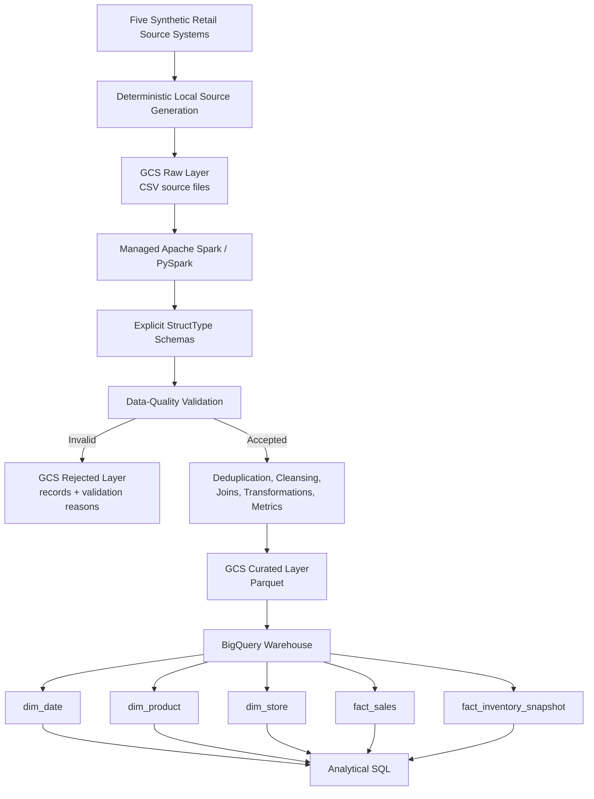

# NullMarket: Retail Data Engineering Platform

**PySpark | Apache Spark | SQL | Google Cloud Storage | BigQuery | Parquet | pytest**

NullMarket is a portfolio-grade batch data engineering platform built around a fictional Canadian retailer. It integrates five operational retail datasets, applies explicit schemas and reusable data-quality rules, transforms accepted records with PySpark, persists curated Parquet in Google Cloud Storage (GCS), and loads a dimensional BigQuery warehouse for analytical SQL.

The project is intentionally designed to demonstrate **defensible data engineering decisions** rather than simulated enterprise scale. It includes local and Google-managed Spark execution, rejected-record handling, automated tests, warehouse reconciliation, idempotent repeated processing, and deterministic batch-scoped incremental loading.

## Table of Contents

1. [Project Overview](#1-project-overview)
2. [Business Problem](#2-business-problem)
3. [Architecture Diagram](#3-architecture-diagram)
4. [Technology Stack](#4-technology-stack)
5. [Source Datasets](#5-source-datasets)
6. [Data Model](#6-data-model)
7. [Pipeline Workflow](#7-pipeline-workflow)
8. [Data-Quality Strategy](#8-data-quality-strategy)
9. [PySpark Implementation](#9-pyspark-implementation)
10. [BigQuery Warehouse](#10-bigquery-warehouse)
11. [SQL Examples](#11-sql-examples)
12. [Testing](#12-testing)
13. [Repository Structure](#13-repository-structure)
14. [Setup Instructions](#14-setup-instructions)
15. [Design Decisions](#15-design-decisions)
16. [Scalability Considerations](#16-scalability-considerations)
17. [Productionization Opportunities](#17-productionization-opportunities)

## 1. Project Overview

NullMarket demonstrates an end-to-end batch data engineering workflow:

```text
Synthetic sources
    -> local deterministic generation
    -> GCS raw
    -> PySpark / Managed Apache Spark
    -> validation + rejected records
    -> GCS curated Parquet
    -> BigQuery dimensional warehouse
    -> analytical SQL
```

Implemented capabilities include:

- five-source retail ingestion;
- explicit PySpark `StructType` schemas;
- deterministic synthetic data with controlled defects;
- reusable data-quality validation and rejected-record quarantine;
- multi-table PySpark joins and business transformations;
- fact/dimension construction with declared grains and warehouse keys;
- aggregations and window functions;
- curated Parquet with selective physical partitioning;
- local Spark and Google-managed Spark execution;
- partitioned and clustered BigQuery fact tables;
- analytical and independent warehouse-validation SQL;
- automated pytest coverage;
- repeated full-refresh execution without unintended duplicate business records;
- deterministic batch-scoped incremental processing;
- retry-safe insert-only BigQuery `MERGE` loading.

After the Phase 17 incremental load, the validated BigQuery warehouse contains:

| Table | Rows |
|---|---:|
| `dim_date` | 94 |
| `dim_product` | 99 |
| `dim_store` | 12 |
| `fact_sales` | 1,515 |
| `fact_inventory_snapshot` | 8,328 |

## 2. Business Problem

NullMarket represents a retailer whose sales, product, store, and inventory information originates in separate operational datasets with different grains, schemas, relationships, and quality risks.

Without an integrated analytical layer, downstream users would need to repeatedly reconcile those sources themselves. That creates opportunities for inconsistent business logic, invalid joins, duplicated measures, and untrusted metrics.

The platform therefore centralizes and validates the data needed to answer questions such as:

- What is daily revenue and seven-day rolling revenue?
- Which stores, products, and categories generate the most revenue?
- What is average order value?
- What is gross margin by product or category?
- How do stores rank within a province or region?
- Which product/store combinations are below their reorder level?
- What is the latest inventory position for each product and store?

Authoritative business definitions live in [`docs/business_requirements.md`](docs/business_requirements.md).

## 3. Architecture Diagram



The Phase 17 incremental path follows the same logical architecture but scopes new orders, order items, and inventory snapshots to a deterministic batch prefix. Existing product/store reference data is reused so established surrogate-key mappings remain stable. New warehouse rows are inserted using deterministic business keys and insert-only `MERGE` logic.

See [`docs/architecture.md`](docs/architecture.md) for the implemented component, data-flow, storage, warehouse, and security boundaries.

## 4. Technology Stack

| Layer | Technology | Implemented role |
|---|---|---|
| Language | Python | deterministic generation and pipeline entry points |
| Distributed processing | PySpark / Apache Spark | schemas, validation, joins, transformations, aggregations, windows |
| Cloud object storage | Google Cloud Storage | raw, rejected, curated, and incremental batch paths |
| Curated format | Parquet | typed columnar analytical storage |
| Warehouse | BigQuery | dimensional warehouse, partitioning, clustering, incremental merge |
| Querying | Spark SQL / GoogleSQL | analytics, warehouse validation, incremental reconciliation |
| Testing | pytest | data-quality and transformation behavior |
| Configuration | YAML | local/GCP paths and environment settings |
| Version control | Git / GitHub | source control and project history |

Pinned Python dependencies are recorded in `requirements.txt`:

```text
pyspark==4.0.4
pytest==9.1.1
PyYAML==6.0.3
```

## 5. Source Datasets

NullMarket simulates five operational source systems.

| Dataset | Grain | Business key |
|---|---|---|
| `orders` | one row per order | `order_id` |
| `order_items` | one product line within an order | (`order_id`, `line_number`) |
| `products` | one row per product | `product_id` |
| `stores` | one row per store | `store_id` |
| `inventory_snapshots` | one product, at one store, on one snapshot date | (`snapshot_date`, `store_id`, `product_id`) |

The baseline generator uses a fixed random seed so source generation is reproducible. It also injects deterministic defects such as duplicate keys, required-value failures, malformed timestamps, invalid foreign keys, negative quantities/prices, and invalid inventory values so the quality framework can be exercised predictably.

Only small representative samples are stored under `data/sample/`; generated bulk data remains outside Git.

See [`docs/data_dictionary.md`](docs/data_dictionary.md) for source types, nullability, keys, definitions, and validation rules.

## 6. Data Model

NullMarket uses two facts that share conformed date, product, and store dimensions.

```text
                    dim_date
                    /      \
                   /        \
          fact_sales      fact_inventory_snapshot
             |   \            /   |
             |    \          /    |
             v     v        v     v
       dim_store  dim_product
```

### Dimensions

- `dim_date`: one row per calendar date; deterministic `YYYYMMDD` `date_key`.
- `dim_product`: one row per accepted current product; warehouse `product_key` plus source `product_id`.
- `dim_store`: one row per store; warehouse `store_key` plus source `store_id`.

### Facts

`fact_sales` grain:

```text
one row per validated (order_id, line_number)
```

Core measures:

```text
gross_sales  = quantity * unit_price
net_sales    = gross_sales - discount_amount
gross_margin = net_sales - (quantity * unit_cost)
```

`fact_inventory_snapshot` grain:

```text
one row per date x store x product snapshot
```

Low stock is defined as:

```text
quantity_on_hand < reorder_level
```

Sales and inventory remain separate facts because they represent different business processes and incompatible grains. Sales is transactional; inventory is point-in-time state. Joining both facts directly at raw fact grain would risk repeating inventory measures across multiple sales lines.

See [`docs/data_model.md`](docs/data_model.md) for complete key, measure, grain, and modeling rationale.

## 7. Pipeline Workflow

### Full-refresh path

1. Generate the five deterministic local source datasets.
2. Land source-format CSV data in the GCS raw layer.
3. Read each source with an explicit `StructType` schema.
4. Validate required values, keys, relationships, and documented business rules.
5. Separate accepted and rejected rows; preserve rejection reasons.
6. Build conformed dimensions and transform accepted sales/inventory data.
7. Calculate documented sales measures and low-stock logic.
8. Verify fact grain, row-count preservation, and measure reconciliation.
9. Write the five warehouse-shaped curated datasets as Parquet.
10. Read persisted Parquet back and verify schema, values, grain, and semantics.
11. Load BigQuery and independently validate the warehouse with SQL.

Repeated execution with identical source input was exercised without creating unintended duplicate business records.

### Incremental path

Phase 17 adds a separate batch-scoped incremental workflow instead of replacing the known-good full refresh:

1. Generate only new orders, order items, and inventory snapshots for later business dates.
2. Store the batch under an incremental raw prefix.
3. Reuse unchanged product/store reference data.
4. Validate the new records with the existing quality framework.
5. Verify product/store surrogate-key mappings remain stable.
6. Write only new `dim_date`, `fact_sales`, and `fact_inventory_snapshot` Parquet to a batch-scoped curated path.
7. Load the new rows through insert-only BigQuery `MERGE` statements.
8. Reconcile untouched historical Parquet separately from the new incremental Parquet.

Retrying the same Phase 17 BigQuery batch does not duplicate already-loaded business keys.

## 8. Data-Quality Strategy

Data quality is implemented as a reusable module rather than being scattered through pipeline orchestration.

Validation coverage includes:

- required and non-blank fields;
- primary-key uniqueness;
- composite-key uniqueness;
- referential integrity;
- positive quantity rules;
- non-negative prices, discounts, costs, inventory, and reorder levels;
- typed date/timestamp validity through explicit schema parsing;
- accepted/rejected record separation.

Rejected records retain an array of human-readable validation reasons. Only accepted parent datasets are used for downstream foreign-key validation, preventing already-invalid parents from being treated as trusted references.

The pipeline also contains runtime correctness guards that are distinct from source-quality rules:

- declared fact-grain uniqueness checks;
- row-count preservation across many-to-one joins;
- independent sales-measure reconciliation;
- Parquet schema/type round-trip checks;
- exact persisted-row comparison with `exceptAll()`;
- inventory semantic checks;
- physical partition-layout checks.

This design treats successful execution as necessary but not sufficient evidence of correctness.

## 9. PySpark Implementation

The Spark code is intentionally separated by responsibility:

- `src/schemas.py` — explicit source contracts;
- `src/data_quality.py` — reusable validation logic;
- `src/transformations.py` — business/data-shaping transformations;
- `src/pipeline.py` — environment-aware full-refresh orchestration;
- `src/pipeline_incremental.py` — Phase 17 batch-scoped incremental orchestration;
- `src/performance_demo.py` — execution-plan, partitioning, shuffle, broadcast, and skew demonstrations.

Representative sales transformation:

```python
sales = (
    sales
    .withColumn(
        "gross_sales",
        (F.col("quantity") * F.col("unit_price")).cast(MONEY_TYPE),
    )
    .withColumn(
        "net_sales",
        (F.col("gross_sales") - F.col("discount_amount")).cast(MONEY_TYPE),
    )
    .withColumn(
        "gross_margin",
        (
            F.col("net_sales")
            - (F.col("quantity") * F.col("unit_cost"))
        ).cast(MONEY_TYPE),
    )
)
```

Implemented Spark techniques include:

- DataFrame `select`, `filter`, and `withColumn` transformations;
- `when` / `otherwise` conditional logic;
- multi-table joins;
- `groupBy` aggregations;
- `row_number`, `rank`, `dense_rank`, `lag`, and rolling windows;
- latest-record selection;
- explicit `DecimalType` handling for money;
- repartitioning/coalescing demonstrations;
- predicate pushdown and partition-pruning inspection;
- shuffle vs. broadcast-join plan comparison;
- execution-plan inspection with `explain()`;
- basic key-distribution/skew analysis.

The same transformation modules run locally and in Google-managed Spark. Environment-specific storage and compute concerns are handled by configuration/orchestration rather than by duplicating business logic.

## 10. BigQuery Warehouse

The BigQuery dataset contains the same five modeled tables as the curated layer.

### Physical design

| Table | Partitioning | Clustering |
|---|---|---|
| `fact_sales` | `order_date` | `product_key`, `store_key` |
| `fact_inventory_snapshot` | `snapshot_date` | `store_key`, `product_key` |

The business-date partition columns are derived from the conformed date dimension during the BigQuery load. Dimension tables are loaded from curated Parquet, while fact data is staged before the final partitioned/clustered tables are built.

The current demonstration data is too small to support defensible claims of measured BigQuery performance or cost improvement. Partitioning and clustering are implemented as justified physical-design patterns aligned with the documented analytical access patterns.

### Incremental loading

Phase 17 uses deterministic business keys with **insert-only** `MERGE` behavior:

- `fact_sales`: (`order_id`, `line_number`)
- `fact_inventory_snapshot`: (`date_key`, `store_key`, `product_key`)
- `dim_date`: `date_key`

A matching key is treated as already loaded; no general update/correction semantics or CDC behavior is claimed.

Post-incremental validation established zero duplicate business keys, orphan relationships, business-date mismatches, sales-measure mismatches, and low-stock mismatches.

## 11. SQL Examples

The repository contains SQL for local curated-layer analysis, BigQuery warehouse creation, analytical queries, validation, incremental loading, and historical reconciliation.

A representative analytical query uses a continuous date dimension plus a window to calculate seven-day rolling revenue:

```sql
WITH daily_sales AS (
    SELECT
        date_key,
        SUM(net_sales) AS daily_net_sales
    FROM fact_sales
    GROUP BY date_key
),
calendar_sales AS (
    SELECT
        d.full_date,
        COALESCE(s.daily_net_sales, 0) AS daily_net_sales
    FROM dim_date AS d
    LEFT JOIN daily_sales AS s
        ON d.date_key = s.date_key
)
SELECT
    full_date,
    daily_net_sales,
    SUM(daily_net_sales) OVER (
        ORDER BY full_date
        ROWS BETWEEN 6 PRECEDING AND CURRENT ROW
    ) AS rolling_7_day_net_sales
FROM calendar_sales
ORDER BY full_date;
```

The incremental warehouse load uses the declared sales grain as the idempotency key:

```sql
MERGE `nullmarket-retail-de.nullmarket_warehouse.fact_sales` AS target
USING (...) AS source
ON target.order_id = source.order_id
AND target.line_number = source.line_number
WHEN NOT MATCHED THEN
    INSERT (...)
    VALUES (...);
```

The analytical SQL suite covers joins, aggregations, CTEs, subqueries, `CASE`, rankings, rolling calculations, contribution percentages, `LAG`, `LEAD`, latest-record selection, and low-stock analysis.

Key files:

- `sql/analytics/01_required_analytics.sql`
- `sql/validation/01_warehouse_validation.sql`
- `sql/ddl/02_bigquery_warehouse.sql`
- `sql/validation/02_bigquery_warehouse_validation.sql`
- `sql/ddl/03_bigquery_incremental_merge.sql`
- `sql/validation/04_incremental_historical_validation.sql`

## 12. Testing

The repository contains **14 focused pytest tests** across data-quality and transformation behavior.

`tests/test_data_quality.py` verifies scenarios including:

- simple and composite duplicate keys;
- required-value failures;
- orphan foreign keys;
- multiple simultaneous rejection reasons;
- invalid product cost/list price;
- invalid inventory values.

`tests/test_transformations.py` verifies scenarios including:

- order-line grain preservation across joins;
- exact gross sales, net sales, and gross margin calculations;
- dimension-key mapping;
- inventory snapshot grain and low-stock logic;
- `row_number` vs. `rank` vs. `dense_rank` tie behavior;
- calendar-aware rolling revenue and lag calculations;
- latest-inventory selection;
- continuous date-dimension construction.

The Phase 12 test run completed with all 14 tests passing. These unit/behavioral tests are supplemented by pipeline runtime guards and independent SQL reconciliation rather than being treated as the only correctness mechanism.

Run the suite with:

```bash
python -m pytest -q
```

## 13. Repository Structure

Core repository structure:

```text
nullmarket-retail-data-engineering-platform/
|
├── .gitignore
├── LICENSE
├── README.md
├── ROADMAP.md
├── requirements.txt
|
├── config/
│   └── config.yaml
|
├── data/
│   └── sample/
│       ├── inventory_snapshots.csv
│       ├── order_items.csv
│       ├── orders.csv
│       ├── products.csv
│       └── stores.csv
|
├── docs/
│   ├── architecture.md
│   ├── business_requirements.md
│   ├── data_dictionary.md
│   ├── data_model.md
│   └── design_decisions.md
|
├── infrastructure/
│   └── README.md
|
├── sql/
│   ├── analytics/
│   │   └── 01_required_analytics.sql
│   ├── ddl/
│   │   ├── 00_curated_views.sql
│   │   ├── 02_bigquery_warehouse.sql
│   │   └── 03_bigquery_incremental_merge.sql
│   └── validation/
│       ├── 01_warehouse_validation.sql
│       ├── 02_bigquery_warehouse_validation.sql
│       └── 04_incremental_historical_validation.sql
|
├── src/
│   ├── data_quality.py
│   ├── generate_data.py
│   ├── generate_incremental_batch.py
│   ├── performance_demo.py
│   ├── pipeline.py
│   ├── pipeline_incremental.py
│   ├── schemas.py
│   └── transformations.py
|
└── tests/
    ├── conftest.py
    ├── test_data_quality.py
    └── test_transformations.py
```

Generated raw, rejected, curated, and incremental bulk data are intentionally excluded from source control.

## 14. Setup Instructions

### Local development

Prerequisites:

- Git;
- Python compatible with the pinned dependencies;
- a Java runtime available to PySpark/Spark.

Clone and create an isolated environment:

```bash
git clone https://github.com/code-of-toad/nullmarket-retail-data-engineering-platform.git
cd nullmarket-retail-data-engineering-platform
python -m venv .venv
```

Activate the environment.

Windows PowerShell:

```powershell
.\.venv\Scripts\Activate.ps1
```

macOS/Linux:

```bash
source .venv/bin/activate
```

Install dependencies:

```bash
python -m pip install -r requirements.txt
```

Generate deterministic source data:

```bash
python -m src.generate_data
```

Run automated tests:

```bash
python -m pytest -q
```

Run the local Spark pipeline:

```bash
python -m src.pipeline
```

With the repository-default local configuration, generated outputs are written under:

```text
data/raw/
data/rejected/
data/curated/
```

The pipeline reads the generated CSVs with explicit schemas, writes rejected records separately, and persists the five curated warehouse-shaped datasets as Parquet.

### Cloud implementation

The implemented GCP environment uses project-specific resources, including a GCS bucket, Managed Service for Apache Spark, a workload service account, networking, and a BigQuery dataset. Reproducing the cloud environment requires your own GCP project/billing/IAM configuration rather than access to the original project.

Cloud resource choices and the implemented GCS layout are documented in [`infrastructure/README.md`](infrastructure/README.md), while the end-to-end cloud architecture is documented in [`docs/architecture.md`](docs/architecture.md).

## 15. Design Decisions

Major implemented decisions include:

**Reuse one transformation layer locally and in GCP.**  
Storage and execution differences belong in configuration/orchestration; business transformation logic should not fork by environment.

**Use explicit schemas.**  
Source types are part of the data contract. Fixed-precision decimals and explicit date/timestamp parsing are safer and more reproducible than schema inference.

**Separate raw, rejected, and curated data states.**  
Raw data supports reprocessing, rejected output preserves quality failures, and curated storage contains only trusted analytical datasets.

**Use Parquet for curated storage.**  
Parquet preserves typed columnar data, supports compression, column pruning, predicate pushdown, and Spark-friendly analytical reads.

**Keep sales and inventory in separate facts.**  
Transactional sales and point-in-time inventory use incompatible grains and additive behavior.

**Partition curated Parquet selectively.**  
`fact_inventory_snapshot` is physically partitioned by `date_key`; the small current `fact_sales` dataset is deliberately not date-partitioned to avoid demonstrating an excessive tiny-file layout.

**Partition BigQuery facts by business date and cluster by analytical keys.**  
The choices match the documented time, product, and store access patterns, without claiming measured savings on the demonstration dataset.

**Use deterministic business keys for incremental idempotency.**  
Insert-only `MERGE` prevents duplicate ingestion when the same Phase 17 batch is retried.

See [`docs/design_decisions.md`](docs/design_decisions.md) for detailed rationale and observed troubleshooting evidence.

## 16. Scalability Considerations

NullMarket's dataset is intentionally modest. The project demonstrates scalable engineering **patterns**, not measured enterprise-scale throughput.

Implemented foundations that are relevant to larger workloads include:

- Spark's distributed DataFrame execution model;
- explicit partition-count inspection;
- understanding of narrow vs. wide transformations and shuffle boundaries;
- broadcast-join comparison for small lookup data;
- predicate pushdown and Parquet partition pruning;
- selective Parquet partitioning;
- partitioned and clustered BigQuery facts;
- incremental processing instead of rebuilding unchanged historical facts;
- separation of cloud storage, compute, and warehouse layers.

At substantially higher volume, engineering decisions would need to be revisited using observed workload characteristics, including:

- Spark partition sizing;
- Parquet file sizing and small-file control;
- shuffle reduction;
- skew detection and mitigation;
- broadcast thresholds;
- batch sizing and backfill strategy;
- warehouse partition/clustering effectiveness;
- operational monitoring and retry behavior.

No performance gain, cost reduction, enterprise-scale volume, or production reliability claim is made without measurement.

## 17. Productionization Opportunities

The current project is a completed portfolio implementation of the required batch data platform, not a production retail platform.

Potential productionization work includes:

- workflow orchestration and scheduled dependencies;
- infrastructure as code;
- CI/CD deployment automation;
- secrets management;
- separate development/staging/production environments;
- centralized monitoring and alerting;
- formal SLAs and operational runbooks;
- audit/control tables and richer pipeline observability;
- data lineage and schema-contract management;
- automated retry/backfill workflows;
- CDC when source update semantics are actually defined;
- disaster-recovery planning;
- formalized IAM policies and security controls;
- streaming only if future business requirements justify it.

These are **opportunities, not implemented features**. NullMarket does not currently claim orchestration, Terraform, CDC, streaming, Kafka, dashboards, production SLAs, or enterprise production readiness.

---

NullMarket is fictional and uses synthetic data only. The project is designed to demonstrate practical, interview-defensible data engineering skills without inventing scale, performance, cost, or business-impact claims.
