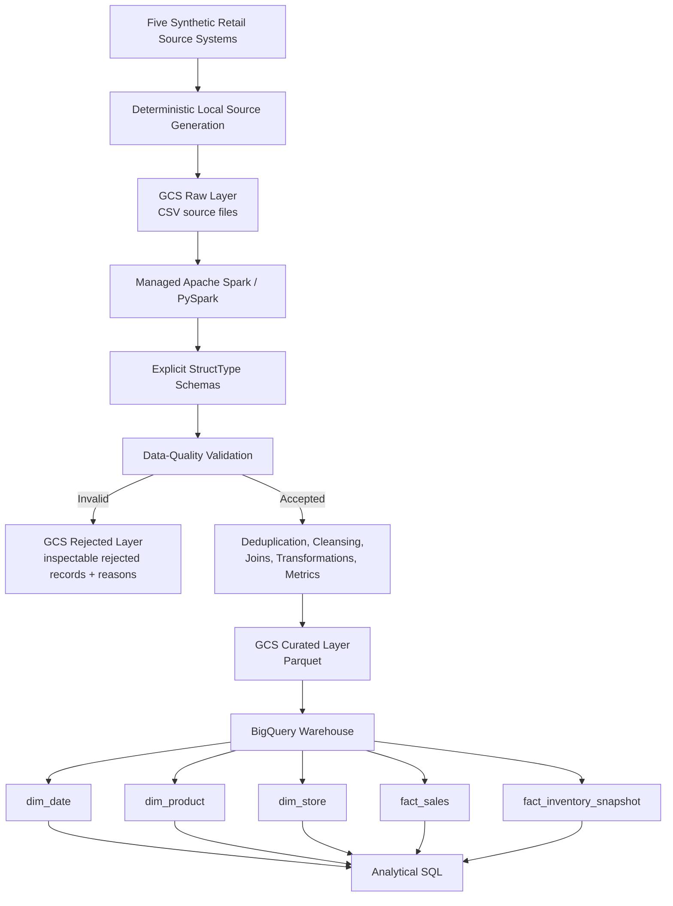

# NullMarket Architecture

## 1. Purpose and Scope

This document describes the architecture that has actually been implemented for the NullMarket retail data engineering platform through Phase 17.

NullMarket is a batch-oriented analytical data platform for five simulated retail source datasets:

- `orders`
- `order_items`
- `products`
- `stores`
- `inventory_snapshots`

The implemented system generates deterministic source data, stores source files in Google Cloud Storage (GCS), validates and transforms the data with PySpark / Apache Spark, persists curated analytical datasets as Parquet, loads a dimensional warehouse in BigQuery, and supports analytical SQL.

This document deliberately separates the **implemented architecture** from technologies that could be added during later productionization. Orchestration platforms, Terraform, CDC, streaming, Kafka, CI/CD, and other optional extensions are not part of the current implementation.

---

## 2. Implemented Architecture Diagram



The Phase 17 incremental path uses the same logical architecture but scopes new transactional and snapshot input/output to a deterministic batch path. Existing product and store reference data are reused so established surrogate-key mappings remain stable. New warehouse rows are loaded with deterministic business keys and insert-only BigQuery `MERGE` logic, allowing the same incremental batch to be retried without duplicate ingestion.

---

## 3. Components

| Component | Implemented responsibility |
|---|---|
| Synthetic source generator | Produces reproducible retail source data using a fixed seed and controlled deterministic defects. |
| Incremental batch generator | Produces a deterministic subsequent batch containing only new orders, order lines, and inventory snapshots. |
| Explicit schema layer | Defines PySpark `StructType` schemas for all five operational datasets. |
| Data-quality layer | Validates required fields, key uniqueness, referential integrity, and documented numeric business rules; separates accepted and rejected rows. |
| Transformation layer | Builds sales and inventory datasets, calculates required measures, creates dimensions/facts, and performs required aggregation/window demonstrations. |
| Pipeline/orchestration entry points | Coordinate configuration, Spark lifecycle, ingestion, validation, transformation, persistence, reconciliation, and execution reporting. No external workflow orchestrator is implemented. |
| Google Cloud Storage | Stores raw source files, rejected records, curated Parquet, and batch-scoped incremental data. |
| Managed Apache Spark | Executes the PySpark workload remotely in GCP while reusing the same transformation logic used locally. |
| BigQuery | Stores the dimensional warehouse in partitioned and clustered analytical tables. |
| SQL layer | Performs independent warehouse validation and required analytical queries. |

---

## 4. Data Flow

### 4.1 Full-refresh path

1. Deterministic Python generation creates the five operational source datasets locally.
2. The source files are uploaded to the GCS raw layer.
3. Spark reads each source with its explicit schema rather than inferring types.
4. The reusable data-quality framework validates source rules and parent/child relationships.
5. Invalid rows are separated from trusted processing and written to the rejected layer with validation reasons.
6. Accepted rows are cleansed, joined, transformed, and mapped to warehouse dimensions/facts.
7. Sales measures are calculated using the authoritative definitions:
   - `gross_sales = quantity * unit_price`
   - `net_sales = gross_sales - discount_amount`
   - `gross_margin = net_sales - (quantity * unit_cost)`
8. Curated warehouse-shaped datasets are written to GCS as Parquet.
9. Persisted outputs are read back and checked for schema, grain, row-count, and measure correctness.
10. Curated data is loaded into BigQuery dimensional tables.
11. BigQuery SQL independently validates counts, uniqueness, relationships, and business measures.

Repeated full-refresh execution with identical source input was validated in Phase 17 and did not introduce unintended duplicate business records.

### 4.2 Incremental path

Phase 17 adds a batch-scoped path without replacing the full-refresh path:

1. A deterministic incremental generator creates only new orders, order items, and inventory snapshots for later business dates.
2. Incremental raw files use a batch-specific GCS prefix.
3. Existing product and store reference data are reused rather than regenerating historical facts or redefining product/store surrogate keys.
4. Spark processes the new transactional/snapshot records and writes batch-scoped curated output.
5. The incremental load verifies that product/store surrogate-key mappings remain unchanged.
6. BigQuery uses insert-only `MERGE` operations based on deterministic business keys.
7. Retrying the same incremental load produces no duplicate warehouse rows.
8. Historical warehouse data is reconciled against the untouched Phase 16 curated history, while new warehouse rows are reconciled against the Phase 17 incremental Parquet.

The incremental implementation demonstrates batch processing of new data. It does **not** implement CDC, streaming, or event-driven ingestion.

---

## 5. Storage Layers

### Raw layer

**Technology:** Google Cloud Storage

**Format:** CSV source files

**Purpose:**

- preserve source-format records before transformation;
- support reprocessing;
- separate operational input from trusted analytical output;
- provide batch-scoped locations for incremental input.

Implemented GCS root:

```text
gs://nullmarket-retail-de-data/raw
```

### Rejected layer

**Technology:** Google Cloud Storage

**Format:** inspectable rejected-record output with flattened validation reasons

**Purpose:**

- prevent invalid source rows from silently entering curated datasets;
- retain failure context for inspection and troubleshooting.

Implemented GCS root:

```text
gs://nullmarket-retail-de-data/rejected
```

### Curated layer

**Technology:** Google Cloud Storage

**Format:** Parquet

**Datasets:**

```text
dim_date
dim_product
dim_store
fact_sales
fact_inventory_snapshot
```

Implemented GCS root:

```text
gs://nullmarket-retail-de-data/curated
```

Parquet is used because the curated layer needs typed, columnar analytical storage with compression and support for Spark optimizations such as column pruning and predicate pushdown.

For the current demonstration data, `fact_inventory_snapshot` is physically partitioned by `date_key` in curated Parquet because it has a small number of snapshot dates. `fact_sales` remains unpartitioned in the curated Parquet layer because its small row count spread across many dates would create an unnecessarily fragmented small-file layout.

---

## 6. Processing Layer

### PySpark transformation responsibilities

The processing layer implements:

- explicit schema application;
- required-value validation;
- primary-key and composite-key validation;
- referential-integrity validation;
- numeric business-rule validation;
- accepted/rejected record separation;
- deduplication and grain protection;
- multi-table joins;
- derived sales measures;
- product/store/date dimension construction;
- sales and inventory fact construction;
- window functions for ranking, rolling revenue, lag, and latest-record selection;
- persisted-output reconciliation.

### Local and managed execution

The same schema, validation, and transformation modules are reused for local and GCP execution. Environment differences are handled by the orchestration/configuration layer through local paths or `gs://` URIs.

Local development explicitly uses `local[*]`. Managed execution leaves Spark master/compute configuration to Google Cloud's managed Spark service.

This separation is intentional: business transformation logic does not change because the storage or execution environment changes.

---

## 7. Warehouse Layer

### Dimensional model

The BigQuery warehouse contains two facts sharing conformed dimensions:

```text
             dim_date
             /      \
            /        \
     fact_sales    fact_inventory_snapshot
        |   \          /   |
        |    \        /    |
        v     v      v     v
   dim_store       dim_product
```

Warehouse tables:

- `dim_date` — one row per calendar date;
- `dim_product` — one row per accepted product in the current warehouse version;
- `dim_store` — one row per store;
- `fact_sales` — one row per validated order line;
- `fact_inventory_snapshot` — one row per product, per store, per snapshot date.

The facts remain separate because sales is transactional while inventory is point-in-time state. Combining them at raw fact grain would multiply measures and make aggregation unsafe.

### BigQuery physical design

`fact_sales`:

- partition: `order_date`;
- clustering: `product_key`, then `store_key`.

`fact_inventory_snapshot`:

- partition: `snapshot_date`;
- clustering: `store_key`, then `product_key`.

These choices align with the documented analytical requirements and business-date filtering patterns. The project does not claim measured performance or cost improvements from the demonstration dataset.

### Warehouse state after Phase 17

| Table | Rows |
|---|---:|
| `dim_date` | 94 |
| `dim_product` | 99 |
| `dim_store` | 12 |
| `fact_sales` | 1,515 |
| `fact_inventory_snapshot` | 8,328 |

Phase 17 validation found no duplicate business keys, orphan relationships, business-date mismatches, sales-measure mismatches, or low-stock mismatches after the incremental load.

---

## 8. Security Boundaries

### Local development boundary

Synthetic source generation and local Spark development occur on the developer workstation. Generated bulk data and credentials are excluded from source control.

### GCP project boundary

Cloud resources are contained in the dedicated GCP project:

```text
nullmarket-retail-de
```

The project is the administrative boundary for enabled services, IAM, billing, storage, managed Spark execution, and BigQuery.

### Cloud Storage boundary

The NullMarket bucket uses:

- uniform bucket-level access;
- public access prevention;
- Google-managed encryption;
- no committed credentials or service-account key files.

The raw, rejected, and curated areas are logical object-name prefixes inside the bucket, not separate security principals or separate storage systems.

### Managed Spark workload boundary

Managed Spark executes with a dedicated non-human service account attached to the workload rather than a committed JSON key. The successful cloud batch used the dedicated regional subnet created for the Spark workload.

The exact IAM role set is not documented here because Phase 18 should not infer permissions that were not explicitly recorded. The intended principle is least privilege.

### BigQuery boundary

The warehouse resides in a dedicated BigQuery dataset in the same NullMarket GCP project. Access is governed through GCP IAM. Row-level security, column-level security, customer-managed encryption keys, and separate development/staging/production projects are not implemented in the current portfolio system.

---

## 9. Failure Handling and Observability

Implemented failure-handling mechanisms include:

- invalid source records are quarantined rather than silently discarded;
- runtime grain and reconciliation checks fail the pipeline when trusted output is inconsistent;
- managed Spark job status and driver logs are inspectable in GCP;
- Spark execution metadata can be inspected through the Spark UI;
- BigQuery validation SQL independently checks warehouse correctness;
- deterministic incremental business keys plus `MERGE` prevent duplicate ingestion on retry.

NullMarket does not currently include an external orchestrator, automated alerting system, centralized monitoring platform, audit tables, or automated retry policy. Those are productionization concepts, not implemented architecture.

---

## 10. Implemented Architecture vs. Productionization Concepts

### Implemented

- deterministic batch source generation;
- five-source ingestion;
- explicit PySpark schemas;
- reusable data-quality validation;
- rejected-record handling;
- PySpark transformations and window functions;
- local Spark execution;
- GCS raw/rejected/curated layers;
- Managed Apache Spark execution in GCP;
- curated Parquet storage;
- dimensional BigQuery warehouse;
- BigQuery partitioning and clustering;
- analytical and validation SQL;
- automated pytest coverage;
- idempotent repeated processing;
- deterministic batch-scoped incremental processing;
- insert-only BigQuery `MERGE` retry protection.

### Not implemented

The following are later productionization or optional concepts and must not be presented as current NullMarket capabilities:

- workflow orchestration;
- Terraform / infrastructure as code;
- CI/CD deployment automation;
- CDC ingestion;
- streaming or Kafka;
- automated production retry scheduling;
- centralized monitoring and alerting;
- formal SLAs;
- data lineage platform;
- secrets-management platform;
- separate development/staging/production cloud environments;
- disaster-recovery automation.

---

## 11. Interview-Defensible Summary

A concise explanation of the implemented architecture is:

> NullMarket is a batch retail data platform. Five deterministic source datasets land in a GCS raw layer. PySpark applies explicit schemas, validates keys and business rules, quarantines rejected rows, and transforms accepted data into dimensional sales and inventory datasets. Curated outputs are stored as Parquet in GCS and loaded into a partitioned and clustered BigQuery warehouse for analytical SQL. The same transformation logic runs locally and on Google-managed Spark. Phase 17 adds deterministic incremental batches and idempotent BigQuery `MERGE` loading without claiming CDC, streaming, orchestration, or production scale.

The key engineering points to defend are the declared data grains, separation of raw/rejected/curated states, storage-agnostic transformation logic, explicit data contracts, source-to-fact reconciliation, dimensional-model boundaries, and the different purposes of Parquet partitioning versus BigQuery partitioning/clustering.
